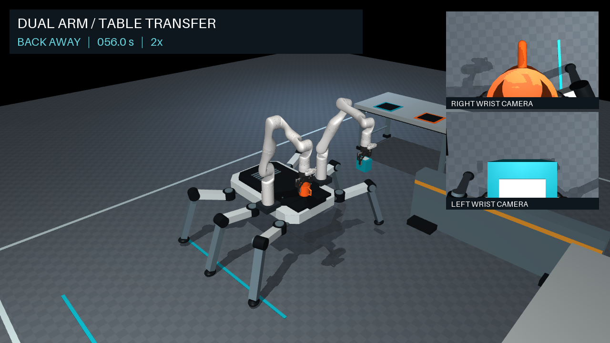
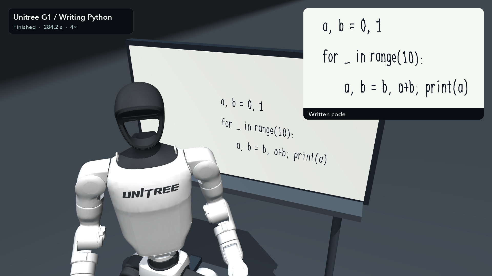

# LLM Robotics Playground 🤖

See what LLMs and VLMs can make robots do.

Experiments in MuJoCo, from untangling headphones and carrying objects to writing on a whiteboard and drawing with a pencil. Watch the demos, replay the runs, or try the same tasks with another model.

| Experiment | Preview | Demo |
| --- | --- | --- |
| [Headphone untangling](experiments/headphone-untangling) | [](experiments/headphone-untangling) | Two robot arms open two tangled cable regions. |
| [Robo spider](experiments/robo-spider) | [](experiments/robo-spider) | A six-legged robot carries and places two objects using two arms. |
| [Fibonacci writing](experiments/fibonacci-writing) | [](experiments/fibonacci-writing) | A humanoid writes a Python program on a whiteboard. |
| [Dove drawing](experiments/dove-drawing) | [](experiments/dove-drawing) | An articulated hand draws a dove with a pencil. |

[Watch or download the demos](https://github.com/dimentary/llm-robotics-playground/releases/tag/v0.1.0).

## Setup

Tested on macOS Apple Silicon with Python 3.14 and MuJoCo 3.12.0. Rendering needs graphics support. Other platforms have not been verified.

Install [uv](https://docs.astral.sh/uv/getting-started/installation/), then clone the repository and install its dependencies:

```sh
git clone https://github.com/dimentary/llm-robotics-playground.git
cd llm-robotics-playground
uv sync --locked
uv run python check.py
```

uv handles Python 3.14 and the project environment. Pick an experiment and follow its README to run it. New results go in its `outputs/` folder, which Git ignores. The experiments share the robot models in `assets/`.

## Replay a demo

Download a recorded run without rerunning the simulation:

```sh
uv run python fetch.py robo-spider
cd experiments/robo-spider
uv run python validate.py
uv run python render.py --preview
```

To try another demo, replace `robo-spider` with its folder name and follow that experiment's replay instructions. Downloads are checked against [recordings.json](recordings.json). If replay files already exist in `outputs/`, move them aside before downloading again.

## How the experiments work

The first experiments used GPT-6 Astra in Codex to build the environments and write the robot-control code. I guided the task setup and gave feedback along the way. The controllers read positions and contacts from the simulator. The code here runs locally without calling a model API. Each experiment's README explains its setup and what the demo shows.

## License

Original code is [MIT licensed](LICENSE). Robot models retain their [upstream licenses](assets/README.md). The dove artwork and artwork-derived assets are excluded from the MIT grant; see the [drawing credits](experiments/dove-drawing/README.md#credits).
