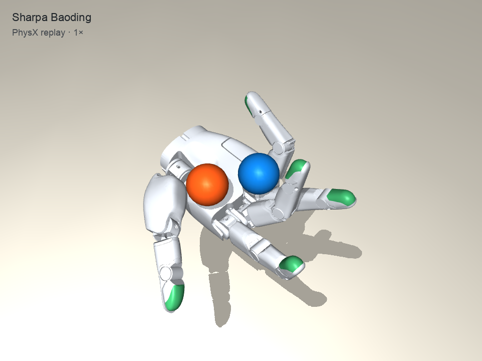

# Baoding balls

A 22-joint Sharpa Wave hand rotates two 19 mm-radius balls in simulation. This package has one fixed Isaac Lab/PhysX PPO trainer, the selected checkpoint and rollout, a recorded-frame validator, and a kinematic replay. It omits the historical training continuations and tuning scripts.

[Watch the selected 12-second demo at 1×](demo.mp4)



## Replay

Complete the [repo setup](../../README.md#setup), then from this directory:

```sh
uv run python validate.py
uv run python replay.py --preview
uv run python replay.py
```

The last command writes `outputs/replay.mp4`. It renders the saved PhysX states at 30 fps with MuJoCo **kinematics only**; it does not re-run the policy or integrate new dynamics. Ball self-orientation is not shown. `demo.mp4` is the already-rendered, verified 1× recording.

## Train

Training requires **Linux x86-64, an NVIDIA GPU, and a separate Isaac Lab Python environment**. The repository's macOS `uv` environment is for replay, not training. The recorded run used Isaac Sim 5.1.0, `isaaclab` 0.54.2, `isaaclab_rl` 0.4.7, RSL-RL 3.1.2, and PyTorch 2.7.0. Follow the [official Isaac Lab installation guide](https://isaac-sim.github.io/IsaacLab/v2.3.0/source/setup/installation/index.html) for that generation of Isaac Sim; other version combinations are unverified.

The trainer needs the official Sharpa USD assets, not only the small MuJoCo model included for replay. From this experiment directory:

```sh
git clone https://github.com/sharpa-robotics/sharpa-urdf-usd-xml.git vendor
git -C vendor checkout 0d19cac602f46456b819e4b6a2c09a74982c9a3e
/path/to/IsaacLab/isaaclab.sh -p train.py --headless \
  --assets vendor --out outputs/train
```

`train.py` starts from random policy weights by default. Its single configuration uses 1,024 environments, 12-second episodes, 60 Hz actions, 32 steps per environment per PPO update, and 200 updates by default (6,553,600 transitions). It settles and checks the static grasp before learning, then saves `outputs/train/final.pt`, the settled reset pose, and the PPO configuration. Use a **new** `--out` directory for every run; a nonempty output directory is rejected. `--num-envs` and `--iterations` only set resource scale and run length.

To continue the included checkpoint instead of starting from random weights, use a fresh output directory and add `--resume baseline.pt`. The included `settled.pt` supplies its reset state; training resumes its optimizer and observation normalizers. This is useful for a short smoke run, but it is **additional training**, not a reproduction of the original selected demo.

The selected checkpoint came from a multi-stage training history. This cleaned, fixed-configuration trainer was distilled from its archived final-stage source, but **a fresh run is not expected to recreate checkpoint 3320 or the video exactly**. The Isaac Lab trainer has not been executed on a GPU after this cleanup; use the pinned stack and check its output before treating a new run as validated.

## Baseline and result

`baseline.pt` is the original PPO checkpoint (iteration 3320, including optimizer and observation-normalizer state), trained in Isaac Lab/PhysX with 1,024 parallel environments. The selected trace is seed 982210, trial 12, from a 12-second, 60 Hz evaluation.

| Selected trial | Recorded result |
| --- | ---: |
| Both balls retained | full first episode |
| Shared net orbital turns | 4.935 |
| Geometry-valid sampled frames | 100% |
| Maximum sampled ball–hand penetration | 0.321 mm |
| All-finger side-risk fraction | 70.65% |

This is a **best-of-archive demonstration**, not the average success rate or a fully validated policy. It was chosen from 592 first-episode records (37 distinct saved evaluation traces) after measured trajectory, joint, and contact checks. The high side-risk score is an unresolved warning, especially around the ring and pinky fingers; it is a geometric heuristic, not a definitive contact classifier. Intermediate physics substeps and the time-zero state were not recorded, so the checks are **not full physics certification**. Reused evaluation seeds and selection from the archive do not establish generalization.

## Provenance and credits

The original full evaluation trace has SHA-256 `e4b9e3fc430ac2bae1f9331b8662cabc94c6e7cf49cf30ac5848835363976866`. `trace.npz` keeps only the selected trial and the fields needed for replay and checks. The unchanged checkpoint SHA-256 is `c777e7411662181d4cb7bcba364dec3d51e4bb87928d51d2eebf743a1ed8a7b4`; the video SHA-256 is `c457bfb915869007ce53440a7b7ce4ce71863f0ed1371b5831ce96819a64c7d0`.

The hand XML and referenced meshes are from [Sharpa's Wave model](https://github.com/sharpa-robotics/sharpa-urdf-usd-xml) at commit `0d19cac602f46456b819e4b6a2c09a74982c9a3e`, under [Apache-2.0](model/LICENSE.txt), with its [notice](model/NOTICE.txt). The local replay and validator code are [MIT licensed](../../LICENSE).

`bounds_ppo.py` is adapted from [RSL-RL 3.1.2](https://github.com/leggedrobotics/rsl_rl) under its [BSD-3-Clause license](bounds_ppo.LICENSE.txt). The added actor-mean bounds loss is required by this checkpoint's training configuration.
