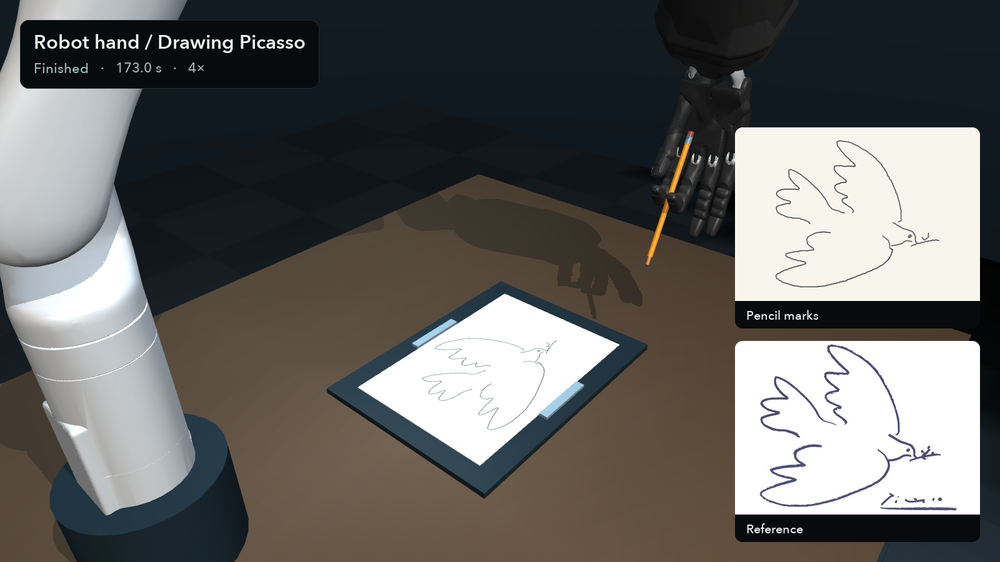

# Dove drawing

A Kinova arm with a Shadow Hand holds a pencil and draws a dove on paper.

[Watch the demo · 4×](https://github.com/dimentary/llm-robotics-playground/releases/download/v0.1.0/dove-drawing.mp4)



## Run

Complete the [setup](../../README.md#setup), then run from the repository root:

```sh
cd experiments/dove-drawing
python run.py
python validate.py
python render.py
```

To replay the recorded demo, run `python fetch.py dove-drawing` from the repository root, then run the validation and rendering commands above. Add `--preview` for selected still frames. All generated files go in `outputs/`.

## Setup and controller

The pencil starts in the hand, tilted about 30°. Finger and palm contact hold it in place, with no fixed attachment. The controller reads the pencil position from the simulator, follows nine traced strokes, and adjusts how hard the tip presses on the paper.

`firmware.py` advances the simulation and records contact marks. `controller.py` moves the arm and wrist, and `writer.py` follows the observed pencil tip. The setup is defined by `scene.xml`, `initial_state.json`, and `strokes.json`.

## Result

The robot completes **nine strokes in 173 simulated seconds**, leaving **10,064 contact marks**. The median distance between the pencil tip and the intended path is **0.149 mm**. At least two hand contact points support the pencil throughout the recorded run, and only its tip touches the paper. The downloaded `outputs/physical_dove_results.json` contains the measurements.

The video plays at 4×. The lines are shown twice as thick so they're easier to see. The renderer shows the target strokes beside the drawing; add a local `reference_dove.png` to use an image there, as in the released video. Startup, a fresh first stroke, the saved results, and replay rendering have been checked.

## Credits

[Menagerie Kinova Gen3 and Shadow Hand models](../../assets/README.md). The reference is a Picasso dove, traced without its signature. The reference image is not included. Artwork-derived paths and imagery are excluded from the repository's MIT grant. Controller code: [MIT](../../LICENSE).
