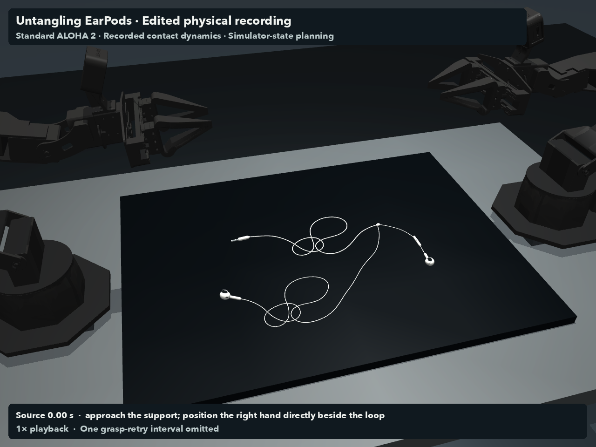

# Headphone untangling

Two ALOHA arms open two tangled regions in a headphone cable using support, lifting, spreading, and local free-end draws.

[Watch the demo · 1×, edited](https://github.com/dimentary/llm-robotics-playground/releases/download/v0.1.0/headphone-untangling.mp4)



## Inspect the recorded attempt

After the [root setup](../../README.md#start-here), download the replay from the repository root:

```sh
python fetch.py headphone-untangling
cd experiments/headphone-untangling
python render.py --name two_clusters_current --output demo \
  --end-time 29.259 --omit 4.23 5.96 --end-hold 1 \
  --elevation -38 --azimuth 75 --distance .96 --lookat -.035 .015 .07
```

Add `--stills` for just the first and last frames. The bundle contains the continuous source trajectory, start/end states, full run report, and original edit manifest. Rendering without edit arguments shows the full source attempt.

## Try a new attempt

Run from this directory:

```sh
python validate.py --seconds .4
python run.py --state settled --name middle_attempt --cluster middle --stage open --dt .0005
```

This runs a guarded local opening stage. The published video was assembled from continuous accepted stages with retries and human-guided revisions; this command is not a one-shot recreation of the complete demonstration. `python run.py --help` lists continuation stages. Inspect the saved report before continuing from a checkpoint.

`python verify_release.py --state NAME` checks a saved endpoint for strict full release. Its JSON verdict is authoritative; the selected demonstration has not passed that completion criterion. To inspect the scene interactively, use `mjpython viewer.py --state initial` on macOS, or `python viewer.py --state initial` elsewhere. Generated files go in `outputs/`.

## Setup and outcome

`scene.xml` and `task.json` define 282 cable segments and two knot/caught-bight regions. Robot geometry and actuator settings match the pinned ALOHA model. The cable has self-collision, with no anchored ends, hidden grasp attachments, or animated cable motion.

The model inspected simulator state and rendered results, wrote actuator-control code, and revised strategies with substantial human feedback. The user helped select the layout, simplify entanglements, favor local lifting/relaxation, and choose the presentation. Exact model settings and a single reusable original prompt were not preserved.

Both local tangled regions opened. Loose overlaps remain at the selected endpoint, so this is not a fully verified untangling solve. The edit omits source 4.230–5.960 s of grasp retries, stops at 29.259 s, and holds the final pose for one second. It changes presentation, not the controller's efficiency. No intermediate poses are synthesized.

The portable scene changes asset paths only. `recording.json` retains both scene hashes; downloaded checkpoints carry the new hash plus original provenance, while numerical recording arrays are unchanged. Public-package checks include asset integrity, compiled-model equivalence, startup, settling/reach checks, and replay previews. The full guided solution was not rerun during packaging.

Inspired by [Qineng Wang's rope-threading experiment](https://x.com/qineng_wang/status/2099893504658866561).

## Assets

[Menagerie ALOHA 2](../../assets/README.md), under its original BSD license. Headphone geometry is approximate. Original code: [MIT](../../LICENSE).
